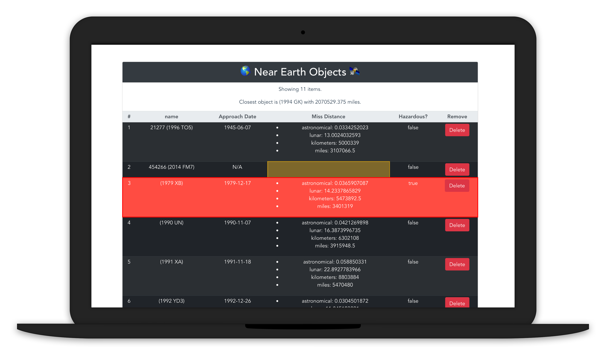

<div align="center">
    <h1> 🚀 Nasa Api Project 🌎️ </h1>
    
</div>

<hr>
Simple project from Lynda's <a href="https://www.lynda.com/JavaScript-tutorials/Learning-Vuejs/737798-2.html"><i>Learning Vue.js</i></a> course.
<br><br>
I went ahead and created the project using `vue create` and developing a Vue Component for the main app.

<hr>
## About❓️️
This app fetches asteroid data from NASA's open APIs and displays a table of them.

<hr>
## Project setup
```
npm install
```

### Compiles and hot-reloads for development
```
npm run serve
```

### Compiles and minifies for production
```
npm run build
```